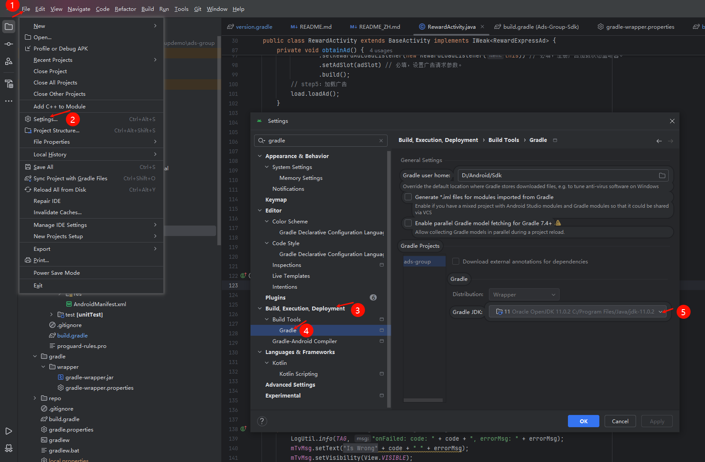

# Ads SDK Sample Code (Android)

English | [中文](README_ZH.md)

## Contents

 * [Introduction](#Introduction)
 * [Preparations](#Preparations)
 * [Environment Requirements](#Environment-Requirements)
 * [Hardware Requirements](#Hardware-Requirements)
 * [Installation](#Installation)
 * [Technical Support](#Technical Support)
 * [License](#License)

## Introduction

In this sample code, you will use the created demo project to call APIs of Honor Ads SDK. Through the demo project, you will:
1.	Learn how the ad service are integrated into your apps.	
2.	Learn what ad styles the ad service offers.

For more information, please refer to
[Service Introduction](https://developer.honor.com/cn/docs/20030/guides/document-updates).

## Environment Requirements

Android targetSdkVersion 30 or later, JDK 11.0.2 or later are recommended, AGP version 4.0 or later, Gradle version 6.1.1 or later.
After opening this project, please go to Settings - Gradle and change the Gradle JDK version to 11.0.2 or above, then sync,See the image below:

## Hardware Requirements

A computer (desktop or laptop) running Windows 10 or Windows 7
A Honor phone with a USB data cable, which is used for debugging

## Preparations
1.	Register as a Honor developer.
2.	Create an app and start APIs.
3.	Import your demo project to Android Studio (Chipmunk | 2021.2.1) or later.  For details, please refer to the [integration preparations](https://developer.honor.com/cn/docs/20030/guides/maven-repository-configuration-guide).

## Installation
Method 1: Compile and build the APK in Android Studio. Then, install the APK on your phone and debug it.
Method 2: Generate the APK in Android Studio. Use the Android Debug Bridge (ADB) tool to run the **adb install {*YourPath/YourApp.apk*}** command to install the APK on your phone and debug it.

## Technical Support

If you have any questions about the sample code, try the following:
- Visit [Stack Overflow](https://stackoverflow.com/questions/tagged/honor-developer-services?tab=Votes), submit your questions, and tag them with `honor-developer-services`. Honor experts will answer your questions.
- Visit the HMS Core section in the [Honor Developer Forum](https://developer.honor.com/cn/forum/?navation=dh11614886576872095748%2F1) and communicate with other developers.

If you encounter any issues when using the sample code, submit your [issues](https://github.com/HONORDevelopers/AdSdk-Alliance-demo/issues) or submit a [pull request](https://github.com/HONORDevelopers/AdSdk-Alliance-demo/pulls).

## License
The sample code is licensed under [Apache License 2.0](http://www.apache.org/licenses/LICENSE-2.0).